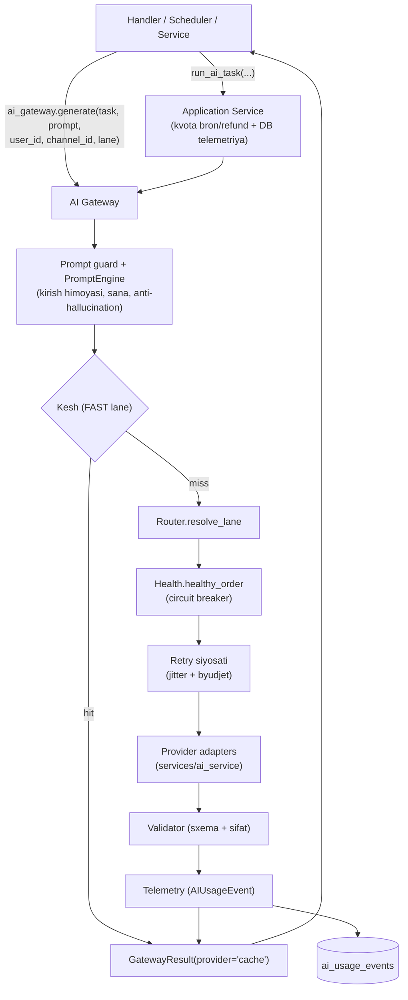

# PHASE 6 — AI ARXITEKTURA KONSOLIDATSIYASI VA XARAJAT NAZORATI

**Sana:** 2026-09-30 · **Branch:** `arena/01a0f1d6-yordamchibot` · **Doira:** faqat `telegram_bot/`

PHASE 6 uchta talab guruhini bajaradi:

1. **KANONIK AI GATEWAY** — barcha handler/servislar AI bilan bitta
   chaqiruv orqali gaplashadi (provayderlarga to'g'ridan-to'g'ri emas).
2. **MUSTAHKAMLANGAN AI ENGINE + XARAJAT NAZORATI** — har bir so'rov uchun
   model/provider/input_tokens/output_tokens/latency/estimated_cost/status
   qayd etiladi; kunlik va oylik hisobot foydalanuvchi va kanal kesimida;
   circuit breaker/timeout/fallback/retry siyosati bitta joyga yig'ilgan;
   production'da Mock **default O'CHIQ**; prompt-injection himoyasi va
   qat'iy validator — sun'iy bypass (`len >= 20`) **YO'Q**.
3. **BACKWARD COMPATIBILITY** — mavjud funksiyalar va importlar buzilmaydi;
   to'liq regressiya 100% yashil.

---

## 1. Qatlamli arxitektura

```
        ┌──────────────────────────────────────────────────────────────┐
        │  HANDLER / SCHEDULER / SERVIS  (handlers/*.py, services/*)    │
        │  ai_assistant · image_post · post_score · content_plan · ...  │
        └───────────────────────────┬──────────────────────────────────┘
                                    │  bitta chaqiruv (yagona interfeys)
                                    ▼
        ┌──────────────────────────────────────────────────────────────┐
        │  KANONIK SIRT — `from services import ai_gateway`             │
        │                                                               │
        │  A) await ai_gateway.generate(                                │
        │         task="social_post"|"channel_dna"|"post_score"|...,    │
        │         prompt=..., user_id=..., channel_id=...,              │
        │         lane="fast"|"smart"|"premium")   → GatewayResult      │
        │                                                               │
        │  B) await run_ai_task(          ← APPLICATION SERVICE         │
        │         db=db, task=..., prompt=..., user_id=...,             │
        │         channel_id=..., lane=...)        → AITaskOutcome      │
        └───────────────────────────┬──────────────────────────────────┘
                                    ▼
        ┌──────────────────────────────────────────────────────────────┐
        │  AI GATEWAY (services/ai_engine/gateway.py — AIGateway)       │
        │                                                               │
        │   1. prompt guard (kirish)  → strip_instruction_leaks()       │
        │   2. PromptEngine.build()   → [SYSTEM][DATE][ANTI-HALLUC.]... │
        │   3. cache.get()            → FAST lane deterministik kesh    │
        │   4. router.resolve_lane()  → FAST | QUALITY | REASONING | VISION │
        │   5. health.healthy_order() → circuit breaker (ochiq — oxirga)│
        │   6. retry siyosati (retry.py) — jitter'li backoff + byudjet  │
        │   7. providers.execute_provider() → services/ai_service       │
        │      adapterlari (asyncio.wait_for + validate_output)         │
        │   8. validator — sxema + sifat (bypass YO'Q)                  │
        │   9. telemetry — model/token/latency/xarajat/status           │
        │  10. cache.set() — muvaffaqiyatda                             │
        └───────────────────────────┬──────────────────────────────────┘
                                    ▼
        ┌──────────────────────────────────────────────────────────────┐
        │  TELEMETRIYA (services/ai_engine/telemetry.py)                │
        │  AIUsageEvent → UsageRecorder (in-memory)                     │
        │               → database.save_ai_usage_event (ai_usage_events)│
        │               → report(daily|monthly|all, user/channel)       │
        └──────────────────────────────────────────────────────────────┘

        Legacy (backward compatibility) — O'ZGARMAGAN:
        utils/ai_agent._run_ai_chain → gateway.legacy_chain →
        services.ai_service.run_ai_chain (8 provayderli zanjir)
        (bu yo'l ham endi telemetriyaga yoziladi: task="legacy_chain")
```

Mermaid ko'rinishida:



---

## 2. Kanonik interfeys (talab 1)

### 2.1 To'g'ridan-to'g'ri generatsiya

```python
from services import ai_gateway

res = await ai_gateway.generate(
    prompt="Kofe do'koni uchun ijtimoiy tarmoq posti",
    task="social_post",        # social_post | channel_dna | post_score | repurpose | ...
    user_id=42, channel_id=-1001001,
    lane="fast",               # "fast" | "smart" | "premium"  (yoki FAST/QUALITY/REASONING/VISION)
)
res.ok, res.text, res.provider, res.model
res.input_tokens, res.output_tokens, res.latency_ms
res.estimated_cost, res.priced, res.status, res.attempts
```

`GatewayResult` — **hech qachon istisno otmaydi** (fail-soft): timeout →
`error=ai_timeout_message`, boshqa xatolar → `error=ai_unavailable_message`.

### 2.2 To'liq tsikl (kvota + telemetriya + hisobot)

```python
from services.ai_gateway import run_ai_task

outcome = await run_ai_task(
    db=db, task="social_post", prompt="...",
    user_id=42, channel_id=-1001001, lane="smart",
    context=context, ctx_prefix="magic",   # FSM bron ID'si uchun (ixtiyoriy)
)
# outcome.ok / .text / .provider / .model / .estimated_cost / .usage
# outcome.refunded — xatoda bron TO'LIQ qaytarilgani
# outcome.usage_id — ai_usage_events yozuv ID'si
report = await ai_tasks.usage_report(db, user_id=42, period="daily")
```

Oqim: **Handler → Application Service → AI Gateway → Router → Provider Adapter**.

### 2.3 Lane va vazifa xaritasi

| Lane | Ma'nosi | Provayder tartibi | Timeout (default) | Kesh |
|---|---|---|---|---|
| `FAST` (`"fast"`, `"tez"`) | arzon/tez (rewrite, social_post, voice_post, hashtags) | Groq → Gemini → zanjir | 12s (`AI_FAST_PATH_TIMEOUT`) | ✅ |
| `QUALITY` (`"smart"`, `"sifat"`) | sifatli (post_score, audit, repurpose, image_post) | Gemini → Groq → zanjir | 15s | — |
| `REASONING` (`"premium"`, `"chuqur"`) | chuqur tahlil (channel_dna, content_plan, weekly_plan) | Gemini → OpenRouter → Groq → zanjir | 15s | — |
| `VISION` (`"rasm"`) | rasm tahlili | Gemini → zanjir | 15s | — |

PHASE 6 da qo'shilgan kanonik vazifa nomlari: `social_post`, `quick_post`,
`caption`, `voice_post`, `hashtags`, `cta`, `audit_post`, `content_repurpose`,
`image_post`, `channel_dna` — bular `router.TASK_LANES` da allaqachon
mavjud vazifalarga (mos ravishda FAST/QUALITY/REASONING) yo'naltirilgan.

---

## 3. Xarajat/telemetriya oqimi (talab 2)

Har bir so'rov (muvaffaqiyat **ham**, xato **ham**) bitta `AIUsageEvent`
yozuvi bilan qayd etiladi:

| Maydon | Izoh |
|---|---|
| `user_id`, `channel_id` | kesim (hisobot shu bo'yicha) |
| `task`, `lane`, `operation_type` | marshrut va kvota turi |
| `provider`, `model` | haqiqatda ishlagan adapter/model |
| `input_tokens`, `output_tokens` | `estimate_tokens` (4 belgi ≈ 1 token) |
| `latency_ms` | umumiy kechikish |
| `estimated_cost` + `priced` | narx jadvali bo'yicha BAHO; noma'lum model → `0.0` + `priced=False` (to'qima raqam yo'q) |
| `status` | `success` / `failed` (DB CHECK bilan bir xil) |
| `error_code`, `cached`, `attempts`, `prompt_hash`, `reservation_id` | diagnostika |

**Saqllash ikki qavat:**

1. `UsageRecorder` (in-memory, 1000 yozuv) — joriy jarayon hisoboti;
2. `ai_usage_events` jadvali (PostgreSQL) — tarixiy hisobot.

**Hisobot shakli** (`report()` / `database.get_ai_usage_report()`):

```
{
  "period": "daily" | "monthly" | "all",
  "scope": {"user_id": ..., "channel_id": ...},
  "totals": {requests, successes, failures, cache_hits,
             input_tokens, output_tokens, total_tokens,
             estimated_cost_usd, avg_latency_ms,
             priced_requests, unpriced_requests},
  "by_provider": {...}, "by_model": {...},
  "by_task": {...}, "by_lane": {...},
  "by_day": {"YYYY-MM-DD": {...}}      # monthly
}
```

Narx jadvali (`telemetry.PRICE_TABLE`, $/1K token — BAHO):
`gemini-2.5-flash` 0.0003/0.0025 · `gemini-2.5-pro` 0.00125/0.01 ·
`gemini-2.0-flash` 0.0001/0.0004 · `llama-3.3-70b` 0.00059/0.00079 ·
`groq` 0.0002/0.0003 · `openrouter` 0.0005/0.0015 · `mistral` 0.0002/0.0006 ·
bepul tariflar (gemini/cerebras/sambanova/cloudflare/pollinations/mock/cache) — 0.0.
Testlar/ops uchun `set_price_override()` mavjud.

**Retention:** `database.purge_ai_usage_events(days=180, limit=5000)` —
eski yozuvlarni bo'lib-bo'lib o'chiradi (jadval cheksiz o'smaydi).

---

## 4. Ishonchlilik: breaker / timeout / fallback / retry

| Mexanizm | PHASE 6 holati |
|---|---|
| Umumiy timeout | FAST 12s (`AI_FAST_PATH_TIMEOUT`), lane'lar 15s gacha, `asyncio.wait_for` |
| Provayder timeouti | 6–8s (`AI_ENGINE_PROVIDER_TIMEOUT`, default 7s), qolgan byudjet bilan kesiladi |
| Retry siyosati | `retry.py`: `RetryPolicy(max_attempts=2, base_delay=0.12, max_delay=0.5, jitter=35%)`; FAST — kutishsiz; backoff qolgan byudjetdan oshmaydi |
| Qayta urinish sabablari | `rate_limit`, `timeout`, `server_error`, `network`, sifat rad etishlari (`KIND_QUALITY`); dasturiy xato (`other`) — **darhol** keyingi provayder |
| Fallback zanjiri | `health.healthy_order()` — ochiq breaker oxirga suriladi (to'liq bloklanish yo'q) |
| Circuit breaker | `AI_BREAKER_THRESHOLD=3`, `AI_BREAKER_COOLDOWN=600s`; legacy `utils.ai_agent._BREAKERS` bilan mirror |
| Kesh | deterministik `sha256` kalit (prompt+lane+task+lang+tone+is_pro+tizim), TTL 900s, LRU; kesh hit = 0 xarajat |

---

## 5. Mock siyosati (production'da DEFAULT O'CHIQ)

| Muhit | `mock_mode()` | Mock zanjirga tushadimi? |
|---|---|---|
| `ENVIRONMENT=production` (yoki umuman yo'q), `AI_ALLOW_MOCK=0` | `off` | ❌ (fail-closed) |
| `ENVIRONMENT=test` / `testing` | `test` | ✅ (alohida test rejimi) |
| `ENVIRONMENT=development` / `dev` / `local` | `development` | ✅ (alohida dev rejimi) |
| `AI_ALLOW_MOCK=1` (istalgan muhit) | `forced` | ✅ (ochiq, logga ogohlantirish) |

Production'da Mock taqiqlanganda zanjirdan **butunlay** chiqarib tashlanadi
(`gateway_status()["mock"]` da ko'rinadi) va provayderlar tugasa — halol
xato + kvota TO'LIQ qaytariladi (soxta generatsiya YO'Q).

---

## 6. Prompt guard va qat'iy validator (bypass YO'Q)

* **Kirish himoyasi:** `services/ai/prompt_guard.py` — foydalanuvchi matnidagi
  tizim/retry ko'rsatma bloklari (`TAQIQLANADI!`, `[SYSTEM]`, ...) olib
  tashlanadi; `safety.untrusted_input()` mazmunni `<untrusted_input>` ichida
  beradi.
* **Chiqish himoyasi:** `contains_leak()` + `_output_leaks_instructions()` —
  ko'rsatma sizib chiqqan javob qabul qilinmaydi (retry → keyin RAD).
* **Validator zanjiri:** `QualityResult` kodlari — `PROMPT_LEAK`,
  `THIN_OUTPUT`, `FLUFF_OUTPUT`, `LANGUAGE_MISMATCH`, `INVALID_SCHEMA`;
  sxema berilganda `parse_result(strict=True)` — majburiy maydonlar.
* **Sun'iy bypass yo'q:** audit topgan `if val_second.is_valid or len(x) >= 20`
  shaklidagi qoida mavjud emas (statik test + dinamik test bilan qulflangan).

---

## 7. O'zgargan fayllar

| Fayl | O'zgarish |
|---|---|
| `telegram_bot/services/ai_gateway.py` | 🆕 kanonik facade (faqat re-export) |
| `telegram_bot/services/ai_engine/gateway.py` | ✏️ PHASE 6: telemetriya, mock siyosati, retry integratsiyasi, `usage`/`status`/`attempts`, `gateway_status()["usage"]` |
| `telegram_bot/services/ai_engine/app_service.py` | 🆕 Application Service: kvota bron/refund, DB yozuv, hisobot, `quota_status` |
| `telegram_bot/services/ai_engine/telemetry.py` | 🆕 xarajat/token modeli, narx jadvali, `UsageRecorder`, hisobot |
| `telegram_bot/services/ai_engine/retry.py` | 🆕 yagona retry siyosati (jitter + byudjet) |
| `telegram_bot/services/ai_engine/router.py` | ✏️ lane aliaslari (`fast/smart/premium/...`), yangi vazifa nomlari |
| `telegram_bot/services/ai_engine/__init__.py` | ✏️ yangi API eksportlari |
| `telegram_bot/repositories/audit_repository.py` | ✏️ `save_ai_usage_event`, `get_ai_usage_report`, `purge_ai_usage_events` |
| `telegram_bot/database.py` | ✏️ `AI_USAGE_TABLES/INDEXES`, schema verify, ichki migratsiya, facade eksport |
| `telegram_bot/schema.sql` | ✏️ `ai_usage_events` + 2 indeks (literal hisoblar 31/33 saqlangan) |
| `telegram_bot/handlers/content_calendar_flow.py` | ✏️ kontent-reja kanonik shlyuz orqali (legacy zaxira saqlangan) |
| `telegram_bot/tests/ai_gateway_cost_control_test.py` | 🆕 204 tekshiruv |
| `telegram_bot/tests/ai_cost_tracking_db_test.py` | 🆕 49 tekshiruv (real PostgreSQL) |
| `telegram_bot/tests/run_tests.sh` | ✏️ yangi PHASE 6 testlari ichki runnerga ulandi (root runner ularni «4) TO'LIQ REGRESSIYA» bosqichida chaqiradi) |

---

## 8. Backward compatibility kafolatlari

* `services.ai_engine.gateway.generate(...)` — eski imzo ishlaydi;
  `GatewayResult` maydonlari saqlangan (`ok/text/provider/lane/task/cached/
  elapsed/raw/provider_chain`).
* `services.ai_service.run_ai_chain`, `utils/ai_agent.*`, `services/ai/*`
  (orkestrator, validator, prompt guard) — **o'zgartirilmagan**.
* `database.X is repositories.<mod>.X` — PHASE 4 kafolati buzilmagan
  (yangi funksiyalar ham facade orqali eksport qilinadi).
* Yangi env o'zgaruvchilar **qo'shilmadi** — `.env.example` pariteti
  (ikkala nusxa) o'zgarishsiz yashil.
